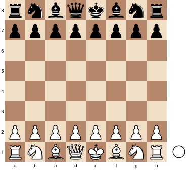

Kokopu-React
============


Kokopu-React is a [React](https://reactjs.org/)-based library to create and display chessboard and chess-related components.
Kokopu-React is built on top of [Kokopu](https://www.npmjs.com/package/kokopu), a headless library that
implements all the chess logic (game rules, parsing of [FEN](https://en.wikipedia.org/wiki/Forsyth%E2%80%93Edwards_Notation)
and [PGN](https://en.wikipedia.org/wiki/Portable_Game_Notation) formats...).

[](https://www.npmjs.com/package/kokopu-react)
[](https://github.com/yo35/kokopu-react/actions/workflows/publish.yml)
[](https://www.npmjs.com/package/kokopu-react)
[](https://github.com/yo35/kokopu-react/actions/workflows/main.yml)
[](https://coveralls.io/github/yo35/kokopu-react?branch=master)


Documentation & live-demo
-------------------------

https://kokopu-react.yo35.org/


Installation
------------

```
npm install kokopu-react
```

If you use [Webpack](https://webpack.js.org/), please look at [webpack configuration](https://kokopu-react.yo35.org/docs/current/#/Webpack%20configuration)
to get more information on how to configure it to handle Kokopu-React properly.


Example
-------

```javascript
import React from 'react';
import { createRoot } from 'react-dom/client';
import { Chessboard } from 'kokopu-react';

createRoot(document.body).render(<Chessboard />);
```



More examples available in [documentation & live-demo](https://kokopu-react.yo35.org/).
