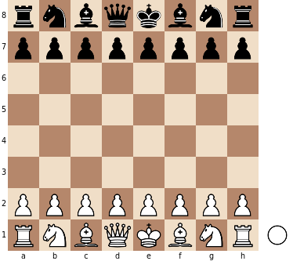

Kokopu-React
============


Kokopu-React is a [React](https://reactjs.org/)-based library to create and display chessboard components.
Kokopu-React is built on top of [Kokopu](https://www.npmjs.com/package/kokopu), a headless library that
implements all the chess logic (game rules, parsing of [FEN](https://en.wikipedia.org/wiki/Forsyth%E2%80%93Edwards_Notation)
and [PGN](https://en.wikipedia.org/wiki/Portable_Game_Notation) formats...).

https://www.npmjs.com/package/kokopu-react

[](https://app.travis-ci.com/yo35/kokopu-react)
[](https://coveralls.io/github/yo35/kokopu-react?branch=master)


Documentation & live-demo
-------------------------

https://kokopu-react.yo35.org/


Example
-------

```javascript
import React from 'react';
import ReactDOM from 'react-dom';
import { Chessboard } from 'kokopu-react';

ReactDOM.render(<Chessboard />, document.body);
```



More examples available in [documentation & live-demo](https://kokopu-react.yo35.org/).
